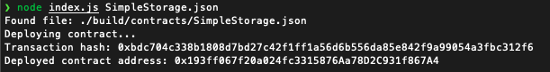

##### Screenshot of the console output immediately after I have successfully deployed a smart contract

##### The transaction hash from the contract deployment
0xbdc704c338b1808d7bd27c42f1ff1a56d6b556da85e842f9a99054a3fbc312f6

##### The deployed contract address from the contract deployment 
0x193ff067f20a024fc3315876Aa78D2C931f867A4