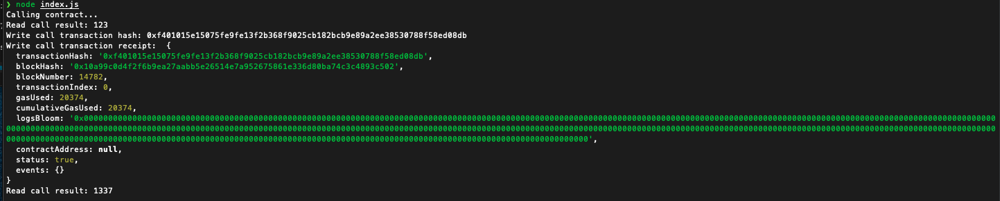

##### Screenshot of the console output immediately after I have successfully issued a smart contract call


##### The transaction hash from the console output
0xf401015e15075fe9fe13f2b368f9025cb182bcb9e89a2ee38530788f58ed08db

##### The contract address that I called 
0x193ff067f20a024fc3315876Aa78D2C931f867A4

##### The ABI for contract I made a call on
```javascript
[
  {
    "inputs": [],
    "stateMutability": "payable",
    "type": "constructor"
  },
  {
    "inputs": [
      {
        "internalType": "uint256",
        "name": "x",
        "type": "uint256"
      }
    ],
    "name": "set",
    "outputs": [],
    "stateMutability": "payable",
    "type": "function"
  },
  {
    "inputs": [],
    "name": "get",
    "outputs": [
      {
        "internalType": "uint256",
        "name": "",
        "type": "uint256"
      }
    ],
    "stateMutability": "view",
    "type": "function"
  }
]
```