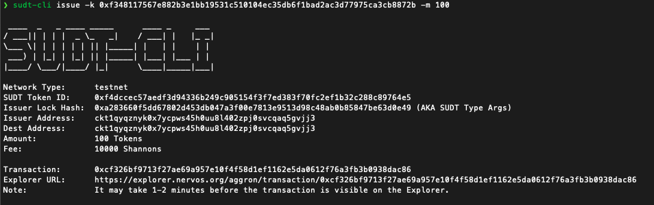

##### Link to the Layer 1 address I funded on the Testnet Explorer
https://explorer.nervos.org/aggron/address/ckt1qyqznyk0x7ycpws45h0uu8l402zpj0svcqaq5gvjj3

##### Screenshot of the console output immediately after using sudt-cli to create my SUDT tokens on Layer 1

##### A link to the transaction ID created by sudt-cli on the Testnet Explorer
https://explorer.nervos.org/aggron/transaction/0xcf326bf9713f27ae69a957e10f4f58d1ef1162e5da0612f76a3fb3b0938dac86

##### Screenshot of the console output immediately after I have successfully submitted a deposit to Layer 2 using the account-cli tool

##### The SUDT ID from the console output after executing the deposit script
1042