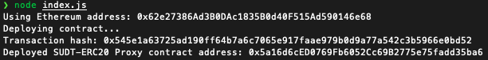
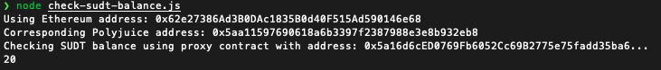

##### Screenshot of the console output immediately after deploying smart contract

##### The address of the ERC20 Proxy Contract I deployed 
0x5a16d6cED0769Fb6052Cc69B2775e75fadd35ba6

##### Screenshot of the console output immediately after checking my SUDT balance

##### The Ethereum address that was checked
0x62e27386Ad3B0DAc1835B0d40F515Ad590146e68